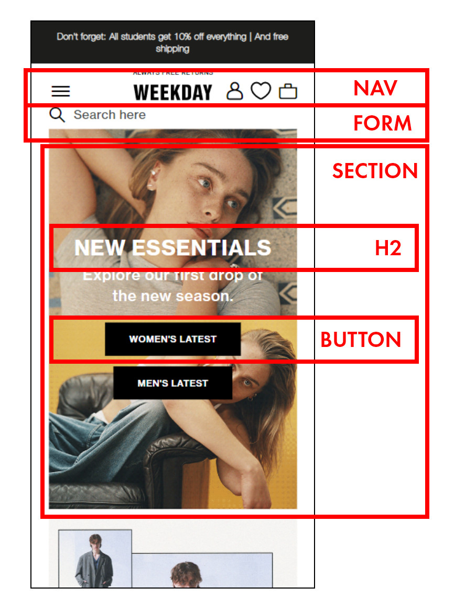
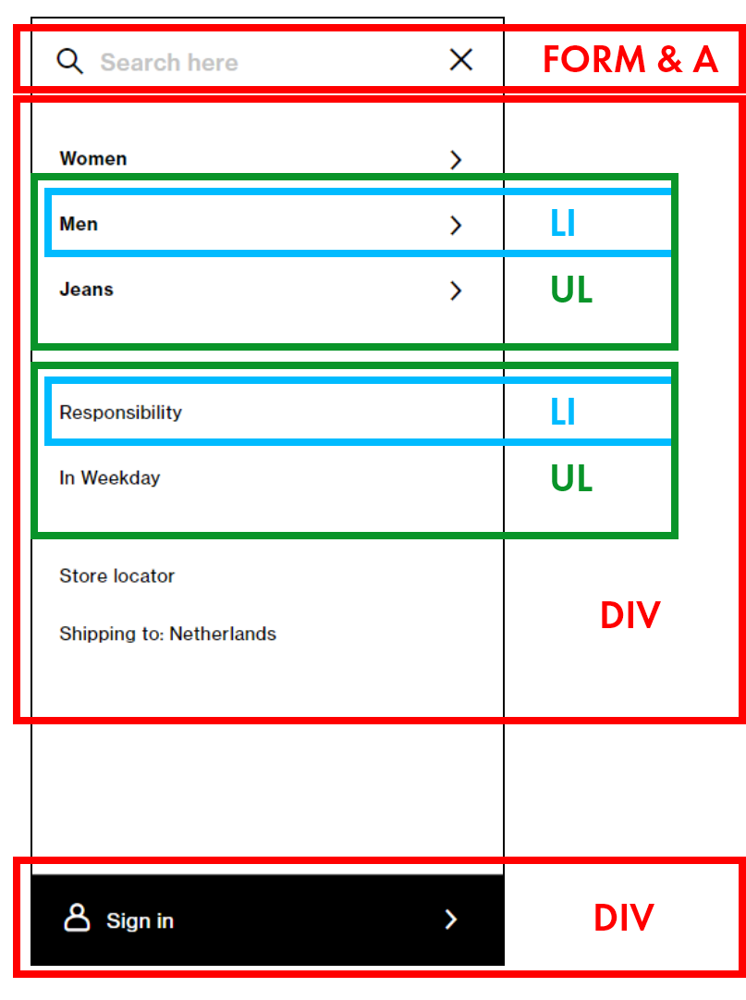

# Procesverslag
Markdown is een simpele manier om HTML te schrijven.  
Markdown cheat cheet: [Hulp bij het schrijven van Markdown](https://github.com/adam-p/markdown-here/wiki/Markdown-Cheatsheet).

Nb. De standaardstructuur en de spartaanse opmaak van de README.md zijn helemaal prima. Het gaat om de inhoud van je procesverslag. Besteedt de tijd voor pracht en praal aan je website.

Nb. Door *open* toe te voegen aan een *details* element kun je deze standaard open zetten. Fijn om dat steeds voor de relevante stuk(ken) te doen.

## Jij

  
uitwerken voor kick-off werkgroep

  ### Auteur:
  Sanne 't Hooft (vervangen door jouw naam)

  #### Je startniveau:
  Blauw

  #### Je focus:
  Responsive
 

## Je website

  
uitwerken voor kick-off werkgroep

  ### Je opdracht:
  link naar de website die je gaat namaken óf de naam/omschrijving van je eigen ontwerp
  https://www.weekday.com/en_eur/index.html

  #### Screenshot(s) van de eerste pagina (small screen): 
  hier de naam van de pagina  
  

  #### Screenshot(s) van de tweede pagina (small screen):
  hier de naam van de pagina  
  
 

## Toegankelijkheidstest 1/2 (week 1)

  
uitwerken na test in 1e werkgroep

  ### Bevindingen
  Lijst met je bevindingen die in de test naar voren kwamen:
  
  - Apples screenreaders maken gebruik van een eigen vorm van gesture bases navigation. Daardoor wordt de gebruikerservaring compleet op z'n kop gegooid.
  - Mijn gekozen website maakt veel gebruik van alt en de images' content wordt beschreven.
  - Veel "Normale Gestures" werken op een compleet andere manier dan verwacht. 
  - Om te scrollen moet je eerst de scrollbar vinden met de screenreader, om vervolgens te dubbel tappen langs het scherm om zo over de gehele pagina te scrollen.            

  #### Screenreader
  
 - Headers kloppen niet. De Narrator leest niet op hierarchische wijze de content van de pagina op. 
- Geen duidelijke focus state voor de screenreader.
- Teveel items in de Nav, duurt lang om bij de normale content van de pagina te komen.
- Afbeeldingen hebben soms wel alt-tekst en soms niet.

  Oplossing: Stroomlijn de content op de pagina en in de nav. Wat is nodig en wat niet. Ook de hierarchie van de pagina zou aangepast moeten worden om de screenreader op een duidelijke navolgbare manier over de pagina scrollt.

  #### Muis en Toetsenbord 
  
Tab: De website maakt gebruik van een dunne border radius rondom de gefocuste content. Wanneer buttons gefocust zijn komt er een witte lijn omheen die bijna niet te zien is op de witte achtergrond. Ook op groter DOM elementen is de zwarte lijn slecht te zien.
Oplossing: Geef de border is een duidelijker kleur, maak hem iets dikker en geef de border wellicht opvallende border-style.

  #### Motoriek (shocks, elastiekjes)
  
Motorisch gezien is deze website prima te gebruiken.
Er zit veel ruimte tussen de content en dingen zoals buttons en klikbare plaatjes zijn groot

  #### Visueel (brillen, contrast, kleurenblind, dark/light). 
  De website is nog redelijk goed te gebruiken, omdat er sprake is van grote dikgedrukte letters, grote plaatjes en ook grotere buttons. Maar voor de meer uitgebreide content zoals beschrijvingen van kledingstukken is de leesbaarheid wellicht nog wat laag.

Oplossing: Geef de letters iets meer ruimte en grote wanneer er sprake is van een uitgebreider stuk tekst.

## Breakdownschets (week 1)

  
uitwerken na afloop 2e werkgroep

  ### de hele pagina: 
  

  ### dynamisch deel (bijv menu): 
  

  ### wellicht nog een dynamisch deel (bijv filter): 
  

## Voortgang 1 (week 2)

  
uitwerken voor 1e voortgang

  ### Stand van zaken
Ik had nog wat moeite met opstarten en het volgen van de huiswerk opdrachten, ik heb vooral gekeken naar mijn keuze van website.

  ### Agenda voor meeting
  samen met je groepje opstellen

  | student 1  (Marc)    | student 2  (Aya)        | student 3 (Robin)   | student 4 (Mats)                |
  | ---            | ---                | ---          | ---                             |
  | HTML/CSS feedback  |Eigen website: hoe zijn hier de h'tjes verdeeld (h1, h2, etc.)? |Kun je grid, flexbox en position door elkaar gebruiken? Of kan het ook anders?     | Een plan opstellen ivm huiswerk |
  | Algemeen, Hamburger menu, Github (vullen we het goed in, zoals website link)| dit als er tijd is | Is mijn HTML goed uitgewerkt? Of wat mist er nog of kan beter? | dit wil ik zeker                |
  | ...            | ...                | ...          | ...                             |

  ### Verslag van meeting
  hier na afloop snel de uitkomsten van de meeting vastleggen
DE meeting verliep erg soepel, Ik merk dat ik ook erg veel baat heb bij bij de antwoorden op de vragen van mijn teamleden.
  - punt 1
  - punt 2
  - nog een punt
  - ...

## Voortgang 2 (week 3)

  
uitwerken voor 2e voortgang

  ### Stand van zaken
  Ik ben nu eindelijk begonnen met het opsetten van mijn website, gaat voor nu erg soepel en heb al redelijk wat progressie gemaakt met de eerste pagina. Ook volg ik de huiswerk opdrachten een stuk meer en snap ik deze erg snel.

  ### Agenda voor meeting
  samen met je groepje opstellen

  | student 1  Marc    | student 2 Aya         | student 3 Robin    | student 4        |
  | ---            | ---                | ---          | ---              |
  | Feedback op zijn code  | Je kan de content veranderen zoals bijvoorbeeld een hamburgermenu img naar een kruisje door 'content: url()' in je css te zetten. Alleen hoe doe je dat als je geen url hebt maar een svg afbeelding?            | Code nakijken ivm responsiveness     | Vraag rondom het gebruik van background images.  |
  | en dat ook nog | dit als er tijd is | nog een punt | dit wil ik zeker |
  | ...            | ...                | ...          | ...              |

  ### Verslag van meeting
  DE meeting ging ook weer erg soepel. Eenmaal wanneer wij in de meeting zaten kwamen er wel een stuk meer specifieke vragen naar boven naar het stellen van de eerste vraag, ik leerde er dus ook erg veel van.

  - punt 1
  - punt 2
  - nog een punt
- ...

## Toegankelijkheidstest 2/2 (week 4)

  
uitwerken na test in 8e werkgroep

  ### Bevindingen
  Lijst met je bevindingen die in de test naar voren kwamen (geef ook aan wat er verbeterd is):

  #### Screenreader
  - Tekst van het hamburger menu wordt nogsteeds opgelezen ook al staat het niet in de viewport.
  - Screenreader blijft heel lang hangen bij de nav.
  
  Oplossing: Meer onderzoek doen naar werking screenreader en hoe je de code op het gebruik daarvan richt.
  
  
  er een omschrijving van hoe het opgelost kan worden (met indien nodig afbeeldingen)

  #### Muis en Toetsenbord 

  In mijn mening goed te gebruiken. Er is zeker een verbetering rondom de focus state van buttons. en rondom normale dom elementen heeft de zwarte border radius 
  iets meer ademruimte.

  #### Motoriek (shocks, elastiekjes)
Naar mijn mening een algehele verbetering, zeker op de zogeheten detail pagina. Ik heb de UI een stuk simpler gemaakt met grote afbeeldingen en iets meer nadruk op gestured based navigation ipv click and drag.

  #### Visueel (brillen, contrast, kleurenblind, dark/light). 
 - Letters zijn soms nog wat klein en slecht te lezen.
  
  oplossing: Lettergrote omhoog

## Voortgang 3 (week 4)

  
uitwerken voor 3e voortgang

  ### Stand van zaken
  Enorm veel progressie gemaakt met het maken van mijn website en ben aan de tweede pagina begonnen, ook wat nieuwe dingen geleerd zoals de scrollsnap property.

  ### Agenda voor meeting
  samen met je groepje opstellen

  | student 1 Marc     | student 2  Aya        | student 3  Robi  | student 4        |
  | ---            | ---                | ---          | ---              |
  | Punt 1 Snel door mijn code website heen kijken. Punt2 Vragen of mijn website voldoende variatie heeft. Punt 3 Mag ik var gebruiken als container rondom tags die wel syntax hebben.  | Aya was helaas ziek | 1. mag ik een class gebruiken om een h1 visually hidden te maken    | Hoe maak een side scroll container, en feedback op code    |
  | en dat ook nog | dit als er tijd is |2. responsiveness op mijn 2e pagina werkt niet helemaal
3. is er genoeg variatie voor het service deel of moet ik nog meer toevoegen | dit wil ik zeker |
  | ...            | ...                |4. waarom ik maar op 1 button kan klikken en de andere buttons dan niet werken terwijl ze hetzelfde doen       | ...              |

  ### Verslag van meeting
Once again erg veel geleerd, Vasilis ging voor Robin wat javascript maken en liet een for while functie zien. erg leerzaam. Ook heb ik meer geleerd over de scrollsnap 
CSS propery
  - punt 1
  - punt 2
  - nog een punt
  - ...

## Eindgesprek (week 5)

  
uitwerken voor eindgesprek

  ### Je uitkomst - karakteristiek screenshots:
  

  ### Dit ging goed/Heb ik geleerd: 
  Korte omschrijving met plaatjes

  

  ### Dit was lastig/Is niet gelukt:
  Korte omschrijving met plaatjes

  

## Bronnenlijst

  
continu bijhouden terwijl je werkt

  Nb. Wees specifiek ('css-tricks' als bron is bijv. niet specifiek genoeg).

  1. ChatGPT (https://chat.openai.com/chat)
  2. Robert & Walter.
  3. ...

